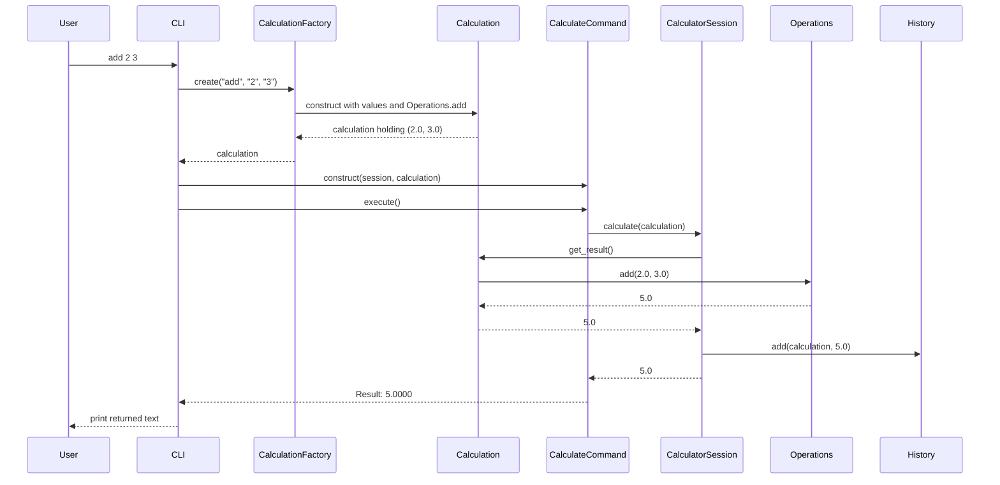

# Follow construction, execution, and failure

Use this page after the relevant part, not as a list of components to memorize at the start. Parts 1–3 establish math and creation; Part 4 introduces application actions; Part 5 adds the file route; Part 6 transfers the flow to prepared sequences.

## Read the final file map

| File | Responsibility |
| --- | --- |
| `calculator/operations.py` | Static math: binary, unary, collection, and configured operations |
| `calculator/validation.py` | Shared conversion to finite numeric values |
| `calculator/calculation.py` | Snapshot operands/options, store a callable, return a finite result |
| `calculator/factory.py` | Normalize a name, select behavior, validate creation rules, return a calculation |
| `calculator/history.py` | Own successful `(calculation, result)` entries and expose controlled access |
| `calculator/session.py` | Calculate first, then record success through `History` |
| `calculator/commands.py` | Calculate/history/clear/help actions with `execute() -> str` |
| `calculator/statistics.py` | pandas mean/deviation and their statistical policy |
| `calculator/inputs.py` | Read the CSV `value` column into a list |
| `calculator/sequence.py` | Execute prepared calculations independently; collect results and expected failures |
| `calculator/cli.py` | Parse input, prepare an action, invoke it, print, and recover |
| `calculator/__main__.py` | Start the interactive application |

Compare the map with the prerequisite. Math selection moved from the CLI into a calculation factory. History remains encapsulated. Application actions acquire an explicit command contract. The extra calls have a purpose; the arithmetic itself is still small.

## Successful arithmetic request



| Moment | Value and type | State or work performed |
| --- | --- | --- |
| User submits a line | `"add 2 3"`, string | CLI receives text |
| CLI splits it | `["add", "2", "3"]`, list | Name and arguments are separated |
| Factory looks up `add` | `Operations.add`, callable | Behavior selected; not called |
| Calculation is constructed | Object with `(2.0, 3.0)` and callable | Operands converted and stored; no addition yet |
| Calculate command is constructed | Object holding session/calculation | Action prepared; history unchanged |
| `get_result()` invokes operation | `5.0`, float | Addition performed |
| Session records success | `(calculation, 5.0)` entry | History changes through `add()` |
| Command returns text | `"Result: 5.0000"`, string | Result formatted; CLI prints it |

`Operations.add` refers to a function. `Operations.add(2, 3)` calls it. `operation(*values, **options)` expands the stored positional operands and named settings. Expand those arguments by hand for `power 3 exponent=4` before following that request in a debugger.

## Failed request: divide 1 0

Zero is a valid finite operand, so construction succeeds. The command asks the session to calculate, and `get_result()` invokes division. `a / b` raises `ZeroDivisionError`. Control unwinds through those callers until the CLI's expected-error handler responds.

The session's `History.add()` call is after `get_result()`, so it is skipped. The command never reaches its successful formatting return. The CLI reports `Error:` and starts the next iteration. A failed request changes no successful-history entries.

Other failures originate earlier. An unknown operation fails during lookup; wrong counts or unsupported settings fail during creation; invalid text fails during conversion. A source failure happens while reading CSV. Label each origin instead of treating every error as a failed calculation.

## History and clear requests

History selection does not call the calculation factory. `HistoryCommand.execute()` asks `session.get_history()` for existing entries. The session delegates to its owned `History`; the returned list is a shallow copy. Formatting reads the saved result rather than executing math again.

Clear delegates to `session.clear()`, which delegates to `History.clear()`. Changing a copied read list cannot clear the session. Help needs no session state. These distinct actions share an execution interface without sharing arithmetic.

Saving a result is not a promise of deep immutability. The list copy contains the same calculation objects, whose public attributes remain assignable. Discuss that boundary explicitly rather than describing entries as fully immutable receipts.

## CSV route

```text
csv stddev values.csv
 → CLI separates source, operation, and path
 → read_csv_values(path)
 → DataFrame → value Series → list of observations
 → CalculationFactory.create("stddev", *values)
 → Calculation → CalculateCommand → session
 → Operations.stddev → standard_deviation
 → finite result → History.add → returned display text
```

The reader owns file structure. Numerical validation and the statistic own observation policy. Both sources use the same factory and calculation; CSV is not a different mathematical operation. Reading occurs during preparation, and the resulting calculation stores its numeric snapshot. Reading the file again could observe different data.

## Prepared sequences in Part 6

Use three prepared requests: valid addition, division by zero, valid square. Preparation returns calculation objects first. Sequence execution attempts each one through the same session, collects successful numeric results and expected error messages, and continues after the failed item.

Predict history lengths after execution: 1, 1, then 2. That trace explains how the same architecture can serve a caller other than the terminal. File-row parsing and exact batch-reporting formats belong to the particular task's contract, not to the calculation object.

## Find the first component to inspect

| Changed requirement | First component(s) to inspect |
| --- | --- |
| New mathematical formula | `Operations`, factory registration/counts/options, tests |
| New session action | Concrete command, CLI preparation, tests |
| New input source/header | Reader and preparation; reuse shared math |
| Changed missing/count/deviation rule | Validation or statistical policy, plus both-source tests |
| Changed display precision | Calculate/history formatting |
| Changed history ownership | `History` public methods and session delegation |
| Continue after an item fails | Sequence caller's recovery boundary and state tests |

Set breakpoints in `prepare_command`, `create`, calculation initialization, `execute`, session `calculate`, `get_result`, the operation, and `History.add`. Step into and out of calls. Repeat zero division and mark the statements that are skipped.
