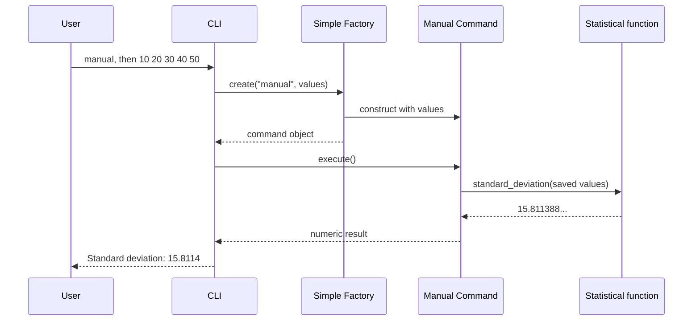

# Follow one request through the application

This describes the final design. Earlier stages introduce only some of these pieces. Use it as a map, then return to the current lesson to build the next part.

## Responsibilities and dependencies

| Component | Knows about | Owns | Does not need |
| --- | --- | --- | --- |
| CLI | Factory and execute() contract | Prompts, loop control, display, recovery | Each concrete class constructor |
| Simple Factory | Concrete command classes | Name normalization and construction selection | Result formatting or execution |
| Manual Command | Its saved values and shared function | A request using supplied values | Keyboard input |
| CSV Command | Its saved path, pandas, shared function | A request that loads the value column | Menu selection |
| Statistical function | Values and pandas | Validation and sample-deviation policy | Terminal or file paths |



## Trace the values and types

| Step | Value | Type or role |
| --- | --- | --- |
| input() | "10 20 30 40 50" | str |
| split() | ["10", "20", "30", "40", "50"] | list of str |
| Factory.create() | ManualStdDevCommand object | Request, not result |
| Command.execute() | Delegates saved values | Method invocation |
| pd.to_numeric(...) | Numeric values | pandas Series |
| Series.std(ddof=1) | Approximately 15.8113883 | Numeric statistic |
| float(...) | Numeric result | Python float |
| Formatting | "Standard deviation: 15.8114" | Display text |

Creating a command is separate from executing it. The manual command snapshots its list at construction. The CSV command stores a path at construction and reads the file during execution. A second CSV execution may observe a changed file; these objects are not automatically immutable or cached.

## CSV takes another route into the same policy

The CLI calls create("csv") without asking for a filename. The factory returns CsvStdDevCommand() using values.csv. execute() calls pandas.read_csv, checks the value column, and delegates that Series to standard_deviation(). It returns the result to the CLI for display.

```text
values.csv -> DataFrame -> frame["value"] -> Series
           -> shared validation/calculation -> float -> CLI display
```

## Map to the general Command description

Read the Structure section of [Refactoring.Guru's Command explanation](https://refactoring.guru/design-patterns/command).

| General role | Our adaptation |
| --- | --- |
| Invoker | CLI invokes execute() |
| Command interface | Abstract Command |
| Concrete commands | ManualStdDevCommand and CsvStdDevCommand |
| Receiver's work | Shared statistical function, rather than a separate receiver object |
| Client/configuration | CLI supplies inputs and uses the factory to construct requests |

This is a small adaptation: the CLI handles client setup as well as invocation. A larger application could split those roles. The factory remains a separate creation helper; it does not replace the invoker.

## Locate changes before making them

| New requirement | Main places to inspect |
| --- | --- |
| Different numeric policy | statistics.py and numeric expectations in tests |
| Different output precision | cli.py and display assertions |
| Additional input source | New command, factory choice, input preparation, tests |
| Different CSV header | CSV command and its contract/tests |
| Web interface | New caller; reuse requests and calculation where their contracts fit |

A new command can share execute(), but the factory, prompts, and tests still need updates. Avoid claiming that adding a pattern eliminates every future edit.

Try drawing the CSV sequence without looking. Label which steps construct objects and which execute requests.
