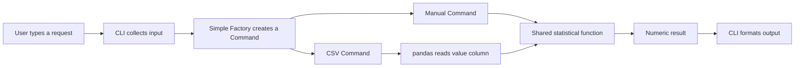

# Before you code: what are we learning, and why?

Imagine that you maintain a calculator used by a teaching assistant. Sometimes they type a few values; sometimes they receive a CSV export. They want the same trustworthy statistic from either source. Next month a colleague may want to call your calculation from another application.

The visible feature is small. The design questions are useful far beyond this calculator: where does input belong, who chooses the operation, who performs it, and how can we test those parts independently?

## Start with your previous calculator

You already created Add and Subtract objects, used a shared get_result() interface, kept history, and connected objects to a terminal loop. That introduced abstraction, inheritance, polymorphism, and collaboration.

| Earlier calculator | New question | This course's answer |
| --- | --- | --- |
| Each calculation stores a and b | What if an operation needs many values? | Give the statistical function a collection |
| The CLI selects an operation class | Who should own construction decisions? | A Simple Factory |
| The calculation exposes get_result() | How can a caller run different requests uniformly? | A Command with execute() |
| Input comes from prompts | What if input comes from a file? | Another concrete Command, same execution contract |
| History assumes two operands | Does that contract still fit? | Leave history out of this application; recognize the changed assumptions |

A method called execute() does not create a pattern by itself. The interesting relationship is that an object stores a request, while another part of the program decides when to run it.

## Separate feature, design, and implementation

| Level | Question | Example |
| --- | --- | --- |
| Feature | What must a user accomplish? | Calculate sample deviation from a CSV |
| Design | Who owns each responsibility? | CSV Command loads values; shared function calculates |
| Implementation | How does Python express this? | pandas.read_csv(path), then standard_deviation(frame["value"]) |

Pandas supplies data-processing tools. It is not a design pattern. Standard deviation is a statistical calculation. It is not a design pattern either. Patterns help arrange the application's responsibilities around those tools and operations.

## Read with a purpose

Read [Refactoring.Guru: What's a design pattern?](https://refactoring.guru/design-patterns/what-is-pattern), especially the opening explanation and the description of a pattern's parts. Then answer:

1. What problem does a pattern describe?
2. Why might two implementations of the same pattern look different?
3. How is a pattern different from a ready-to-call library function?

Our interpretation for this course: pattern descriptions help you make and explain design choices. You still adapt the design to the program you are building. The code and exercises here are original course examples; linked readings provide the broader explanation.

## Three questions that organize the pattern landscape

Read [Refactoring.Guru: Classification](https://refactoring.guru/design-patterns/classification). Its categories distinguish creation, structure, and behavior.

| Category | Practical question | Examples to recognize |
| --- | --- | --- |
| Creational | How should objects be created? | Factory Method, Abstract Factory, Builder |
| Structural | How should components fit together? | Adapter, Decorator, Facade |
| Behavioral | How should actions and communication work? | Command, Observer, Strategy |

Our Simple Factory addresses object creation but is not formal Factory Method or one of the original catalog's named patterns. Command is a behavioral pattern. Read [patterns and familiar features](patterns-and-features.md) for concrete scenarios; you only implement Simple Factory and Command in this assignment.

## See the destination before the details

The arrows show the request's journey, not a claim that the factory runs the commands. The CLI receives the created object and later calls execute(). See [architecture and execution traces](architecture.md) for the exact call sequence.

## Why use patterns for such a small program?

A short function-based program could meet the feature requirements. This course deliberately introduces request objects and a factory so you can practice separating responsibilities and discussing their costs. More classes mean more code to read. The payoff becomes clearer when requests have different inputs, callers need a common interface, or construction rules change.

You should be able to explain both the benefit and the cost. Avoid adding patterns because an assignment lists impressive names.

## Your learning journey

First learn the calculation and its input contract. Then package a manual request, add a CSV request, move selection into a factory, build the invoker, and automate checks. The tutorial is preparation over several study sessions; the practice assessment is a separate 90-minute exercise.

At each checkpoint: predict → type → run → explain → change one thing. Keep a short learning log using [this template](learning-log.md).

Before continuing, say aloud: “The user asks for ___. The CLI owns ___. The command owns ___. The calculation function owns ___.” You will revisit that explanation after each stage.

[Set up your own solution](setup.md) · [Begin Stage 1](lessons/01-statistics.md)
